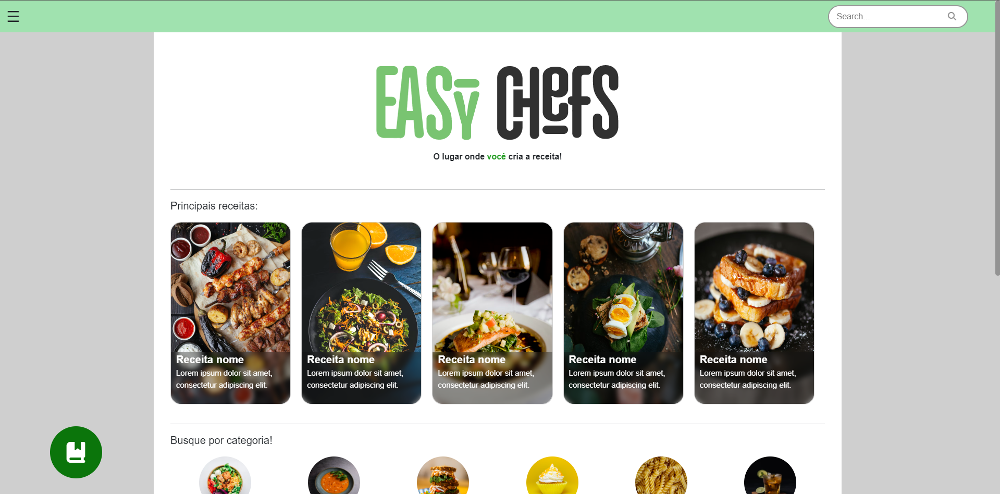
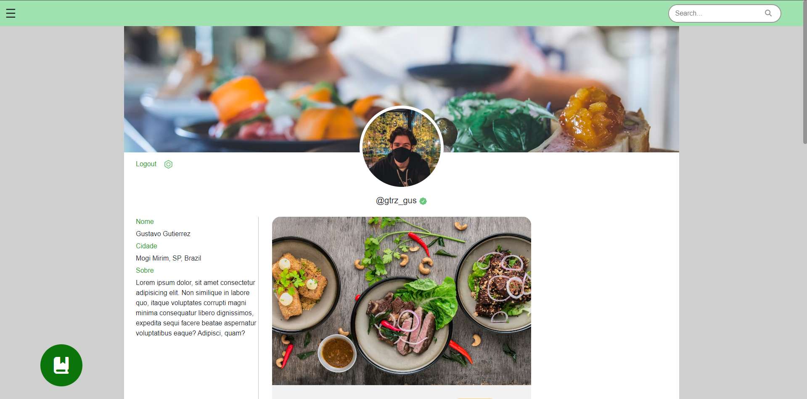
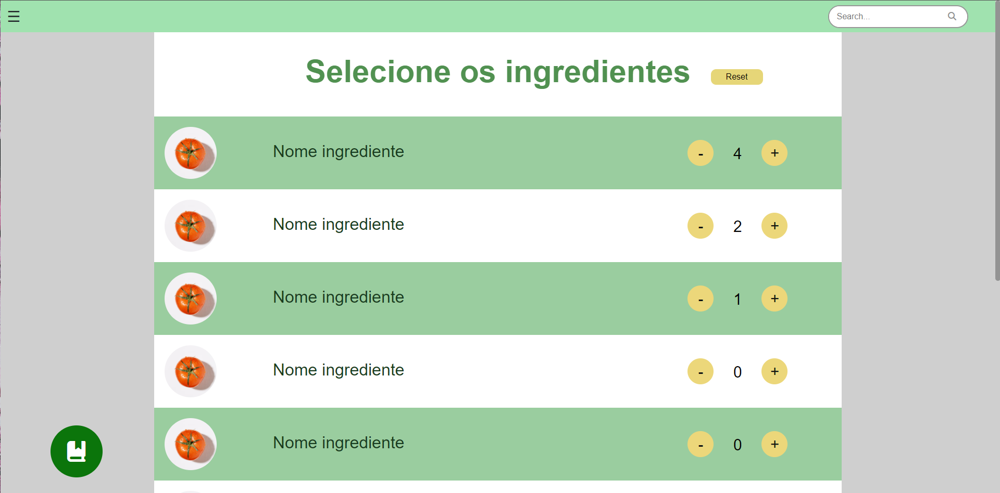

# Trabalho de Conclusão de Curso

> Dados

Curso/módulo: 3 AMSDS FATEC 2022

> Integrantes:
- Avalone Silva Cabrera
- Arthur Cândido de Melo
- Christian Martins Teixeira
- Gustavo Gutierrez
- Gabriel José Pires de Avila
- João Henrique de Oliveira
- Leonardo Henrique dos Santos

## Tecnologias utilizadas nesse projeto:

## Galeria

