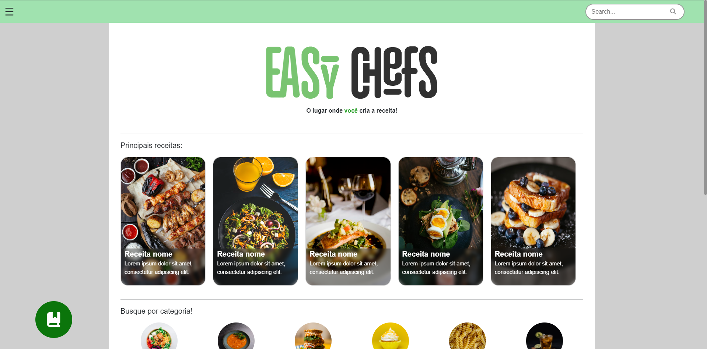
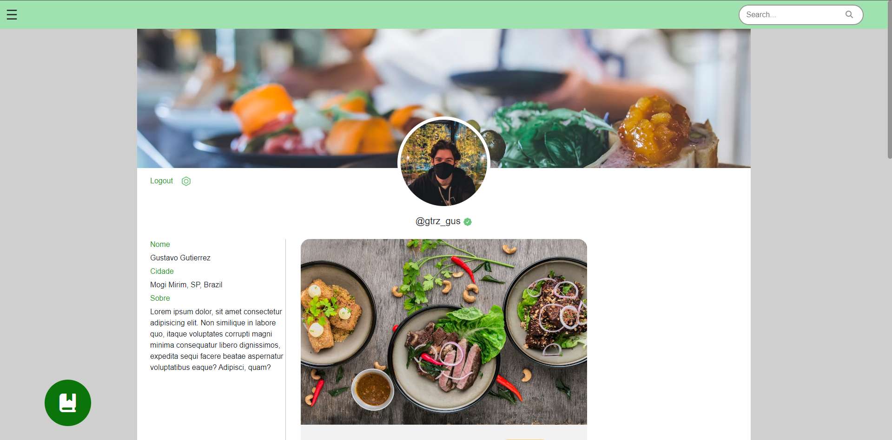
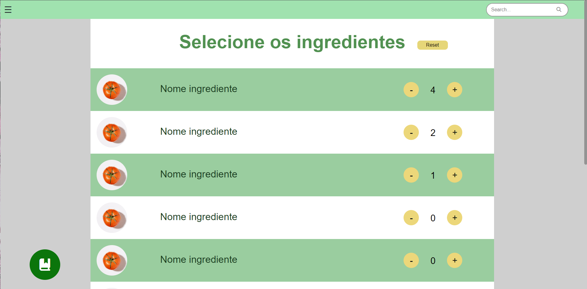
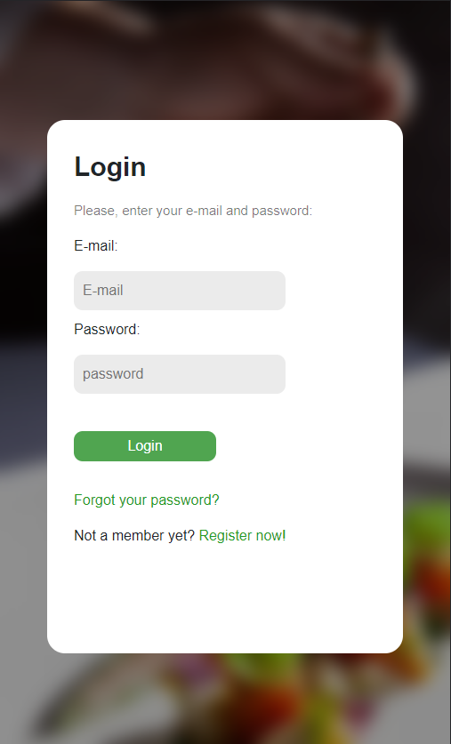

# Trabalho de Conclusão de Curso

>Trabalho de Conclusão de Curso apresentado ao Curso Técnico do Ensino Médio com Habilitação Profissional de Técnico em Desenvolvimento de Sistemas da Etec Pedro Ferreira Alves, orientado pelos Prof. M. Sc. Marcos Roberto de Morais e Prof. Esp. Sinzomar Gomes de Melo como requisito parcial para obtenção do título de técnico em Ensino Médio com Habilitação Profissional de Técnico em Desenvolvimento de Sistemas.

---
 
### Dados

Curso/módulo: 3 AMSDS FATEC 2022

---

### Integrantes:
- Avalone Silva Cabrera
- Arthur Cândido de Melo
- Christian Martins Teixeira
- Gustavo Gutierrez
- Gabriel José Pires de Avila
- João Henrique de Oliveira
- Leonardo Henrique dos Santos

## Sumário
- [Tecnologias utilizadas nesse projeto](#tecnologias-utilizadas-nesse-projeto)
- [Códigos](#códigos)
- [Galeria](#galeria)

## Tecnologias utilizadas nesse projeto:

## Códigos
- [Web](https://github.com/Gustavo2022003/TCC/tree/main/Web)
- [Mobile](https://github.com/Gustavo2022003/TCC/tree/main/Mobile)

## Galeria
> Web

> Web Mobile

